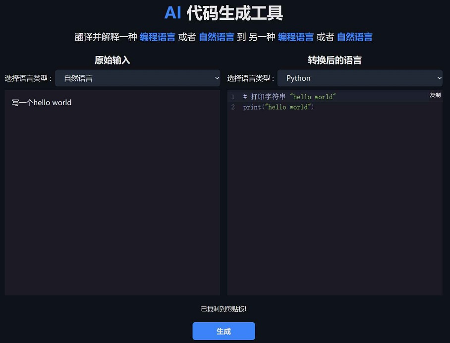
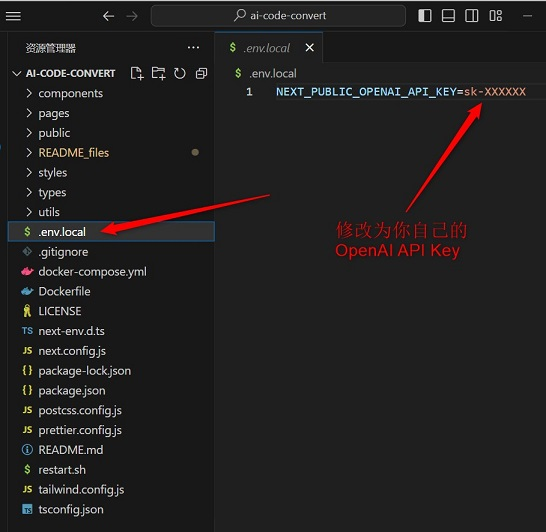

# AI 代码生成工具

翻译并解释一种 编程语言 或者 自然语言 到 另一种 编程语言 或者 自然语言

效果展示页面：[demo](https://code.ikiwi.cc)

Clone of [AI-Code-Convert](https://github.com/JustAIGithub/AI-Code-Convert)
Thanks to JustAIGithub!

## 相比原版，有如下几个变化：
1. 界面翻译为中文
2. 增加语言类型为下拉列表，免除手动输入语言类型，第一个为自然语言
3. 优化后台prompt，使转换后的编程语言自带中文注释

## 支持的编程语言有：
```bash
Android
Assembly Language
Bash
Binary Code
C
C#
C++
COBOL
CSS
Clojure
CoffeeScript
Dart
Decimal Code
Elixir
Fortran
Go
Groovy
Haskell
Hex Code
HTML
Java
JavaScript
Julia
Kotlin
Lisp
Lua
Matlab
Morse Code
NoSQL
Objective-C
Pascal
Perl
PHP
PL/SQL
Powershell
Python
R
Racket
Ruby
Rust
SAS
SQL
Scala
Swift
SwiftUI
TSX
TypeScript
Visual Basic .NET
```

## 界面展示效果如下：



## 本地部署 Running Locally

**1. Clone Repo**

```bash
git clone https://github.com/ikiwihome/ai-code-convert.git
```

**. Config Environment**

1. 将 .env.local.example 更名为 .env.local
2. 将 .env.local.example 文件中的 NEXT_PUBLIC_OPENAI_API_BASE_URL，NEXT_PUBLIC_OPENAI_MODEL，NEXT_PUBLIC_OPENAI_API_KEY 更改为您自己的
3. NEXT_PUBLIC_OPENAI_API_BASE_URL 推荐使用cloudflare代理，这样就可以不用翻墙访问OpenAI的API。




**2. Install Dependencies**

```bash
npm i
```

**3. Run App**

```bash
npm run dev 或 npm run start
```

## 一键Docker部署
```bash
docker run -d --name ai-code-convert -h ai-code-convert --restart=unless-stopped -e TZ="Asia/Shanghai" -e NEXT_PUBLIC_OPENAI_MODEL="gpt-3.5-turbo" -e NEXT_PUBLIC_OPENAI_API_BASE_URL="https://openai-2zn.pages.dev/api/v1/chat/completions" -e NEXT_PUBLIC_OPENAI_API_KEY="sk-xxxxx" ikiwicc/ai-code-convert:latest
```
其中NEXT_PUBLIC_OPENAI_API_KEY换成你自己的key
然后通过IP地址+端口号即可访问，例如：http://127.0.0.1:3000

## 源码修改后Docker镜像构建
```bash
docker build -t ai-code-convert .
```